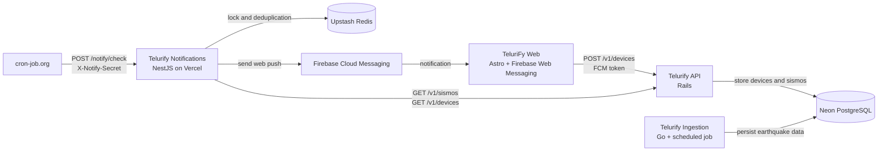

# Telurify Notifications

NestJS service that checks recent significant earthquakes and sends web
notifications through Firebase Cloud Messaging. It does not connect to Neon
or USGS directly. Earthquake data and device tokens are read from
`Telurify-API` over HTTPS.

## Architecture



The notification service communicates with `Telurify-API` over HTTPS and has
no database credentials for Neon.

## Local development

Requirements: Node.js `24.18.0` or newer and npm.

```bash
npm install
cp .env.example .env
npm run build
npm test
npm run start:dev
```

The check endpoint is `POST /notify/check` and requires the
`X-Notify-Secret` header. `LOOKBACK_HOURS` defaults to `6`.

## GitHub Actions

The repository runs CI on pushes and pull requests to `main`. It installs
dependencies with `npm ci`, audits high-severity vulnerabilities, runs the
TypeScript check and tests, and verifies the production build. CodeQL and
Dependabot provide additional security and dependency maintenance.

## Vercel and cron-job.org

Deploy the repository as a Vercel project. The `vercel.json` rewrite exposes
`/notify/check` through the `api/index.ts` serverless handler. Configure all
variables from `.env.example` in Vercel, then configure cron-job.org with:

```text
POST https://<project>.vercel.app/notify/check
X-Notify-Secret: <NOTIFY_SECRET>
```

`UPSTASH_REDIS_REST_URL` and `UPSTASH_REDIS_REST_TOKEN` should point to a
Redis database dedicated to this service. Redis coordinates concurrent cron
runs and keeps a 30-day notification marker keyed by the USGS `external_id`.

## License

This project is released under the [MIT License](LICENSE).
