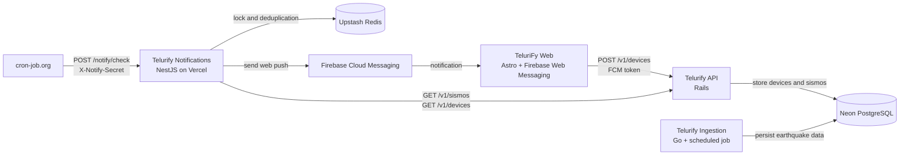

# Architecture

Telurify Notifications is responsible only for detecting significant events
from the existing API and sending web notifications. It does not connect
directly to Neon or USGS.

## Responsibilities

| Component | Responsibility |
|---|---|
| `TeluriFy-Web` | Requests notification permission and registers FCM tokens. |
| `Telurify-API` | Owns device and earthquake data and exposes it over HTTP. |
| `Telurify-Ingestion` | Collects and persists earthquake data from USGS. |
| `Telurify-Notifications` | Finds new events with magnitude `>= 6.0` and sends alerts. |
| `cron-job.org` | Triggers the notification check every 15 minutes. |
| Upstash Redis | Coordinates concurrent checks and stores temporary deduplication markers. |
| Firebase Cloud Messaging | Delivers notifications to subscribed browsers. |

The notification service communicates with `Telurify-API` over HTTPS and has
no database credentials for Neon.
